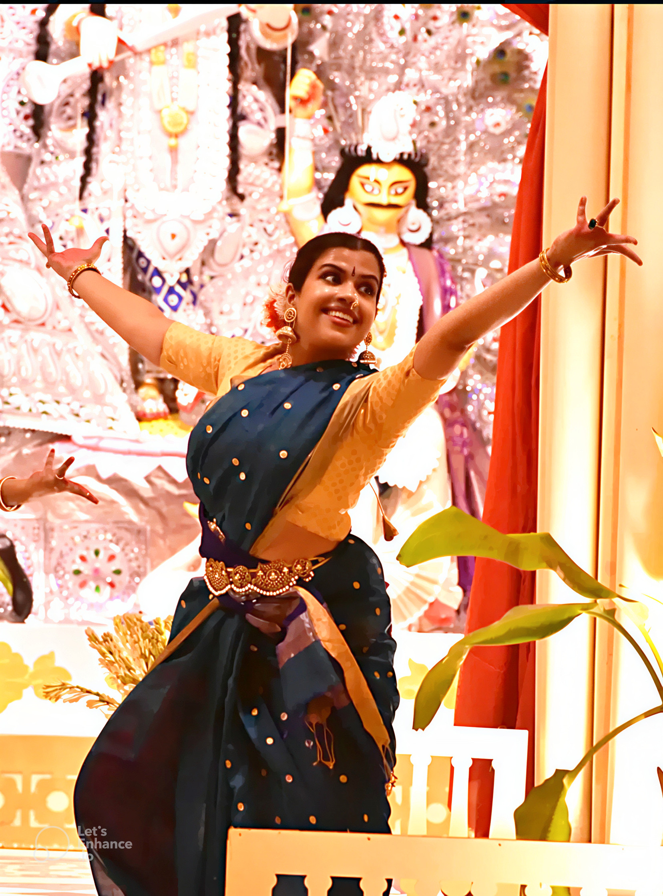

On 12 October 2024, at the Durgotsav Pandal in CR Park, New Delhi, <strong>Ranjana Mahesh</strong> presented a Kuchipudi performance as part of the Navaratri celebrations.

The performance formed part of the festive cultural programme, bringing the expressive and rhythmic traditions of Kuchipudi to the Navaratri stage.

	

