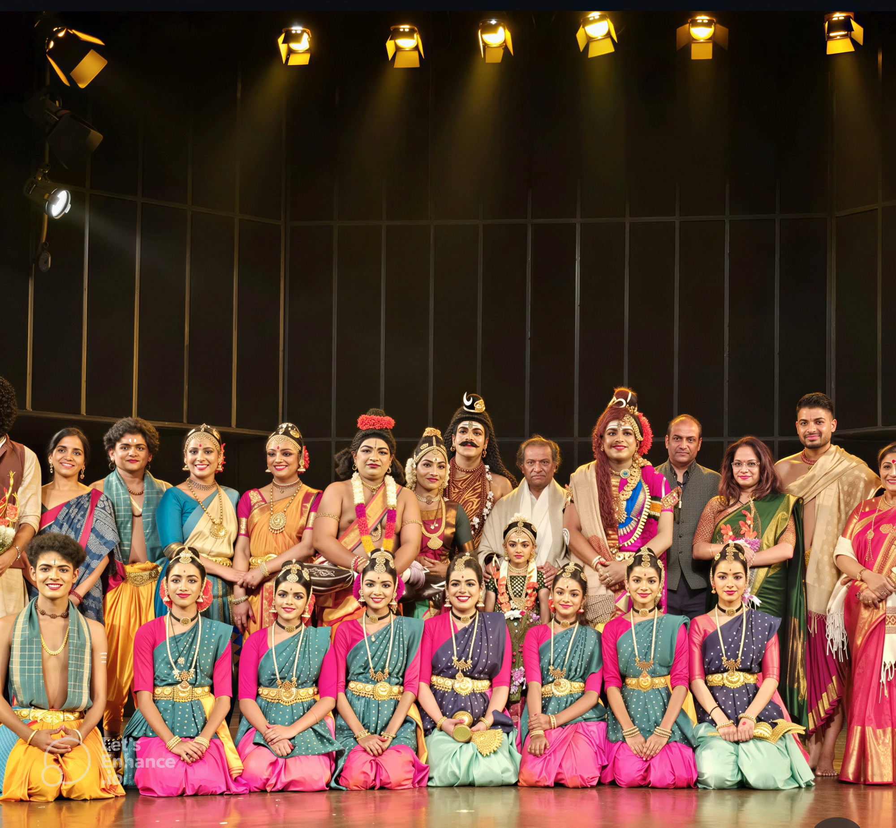

On 22 November 2024, at the India Habitat Centre in New Delhi, <strong>Ranjana Mahesh</strong> performed in <em>Ardhashankaram</em>, a Kuchipudi production choreographed by <strong>Dr. Vasanth Kiran</strong>.

The production explored its theme through the expressive vocabulary of Kuchipudi, combining rhythmic movement, gesture, and storytelling.

	

