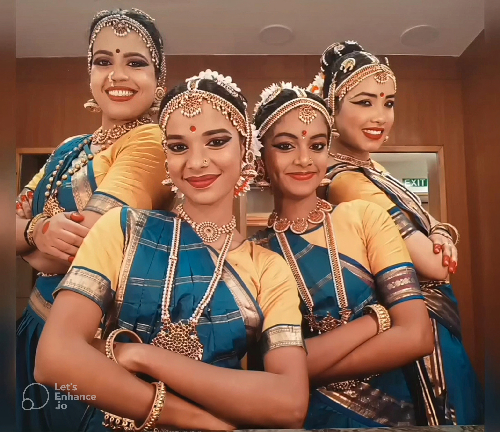

On 17 April 2025, at Renaissance 2025, presented by the Lightsense Art Foundation at the India Habitat Centre in New Delhi, <strong>Ranjana Mahesh</strong> performed <em>Shivashtakam</em> in the Kuchipudi tradition.

The presentation brought the devotional verses of <em>Shivashtakam</em> to life through rhythmic movement, expressive gesture, and storytelling.

	

