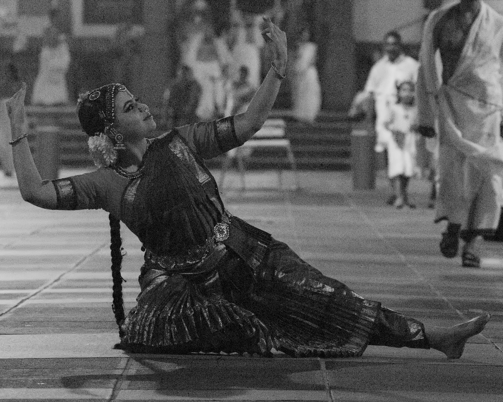

On 15 August 2026, <strong>Ranjana Mahesh</strong> brought the grace and expressive storytelling of Kuchipudi to an Onam celebration at the Sree Padmanabhaswamy Temple in Trivandrum.

The programme unfolded as a devotional journey through four compositions: <em>Lambodara Lakumikara</em>, <em>Pooja Dance</em>, <em>Pibare Rama Rasam</em>, and <em>Sri Vighnarajam Bhaje</em>. Set against the temple&rsquo;s sacred atmosphere, each piece wove together rhythm, expression, and devotion.

	

